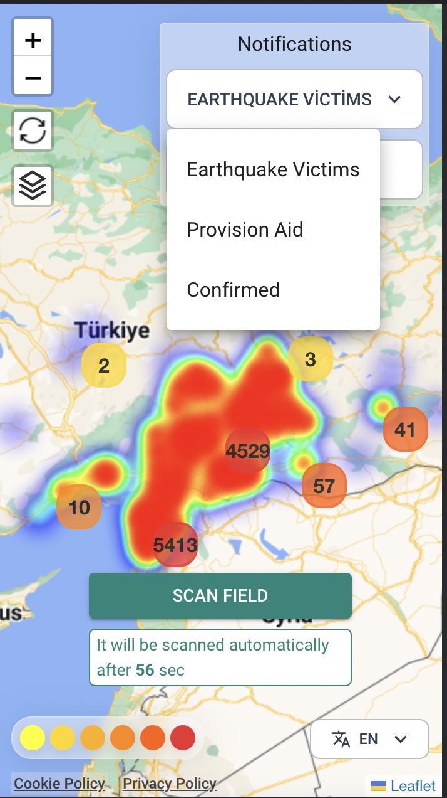

# What is "afetharita"

The project started to be developed on February 6, 2023 in order to help earthquake victims in case of disaster in Turkey. Tens of thousands of volunteer IT employees, each of whom is a hero, united on a discord server. And they tried to visualize the sounds of earthquake victims on a map. thank you to all of them.

# Why it was needed?

In a short summary, after the earthquake, there were people in a difficult situation. Communication was very difficult. Caught unprepared, in this case, they began to make requests for help on social media.

# So then?

Our bright-minded and volunteer engineers have established the necessary communications and turned these requests for help on social media into readable data using technologies such as ML and AI. Thousands of people worked day and night to verify these data.

Thousands of people have organized themselves on a single discord server.

Working together with people they have never met in their field, they have developed a very fast product that can handle **500 thousand unique users and millions of traffic on the first day of its released**.

**In just 2 days.**
It is impossible to express how much stress, busyness they have experienced.
Each of them is a hero.

Will add more details later.

- What is the result?
- What is the future?
