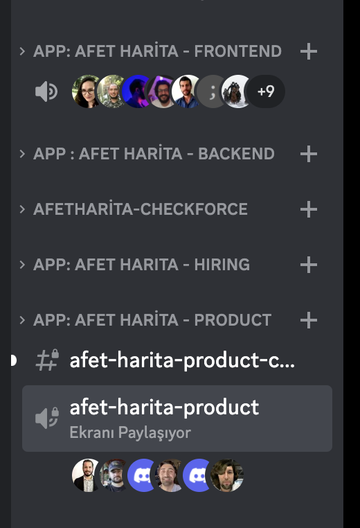
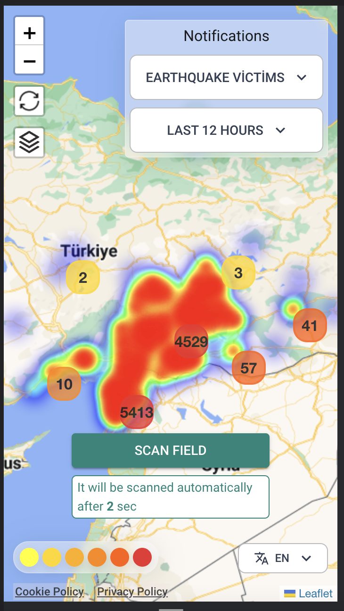
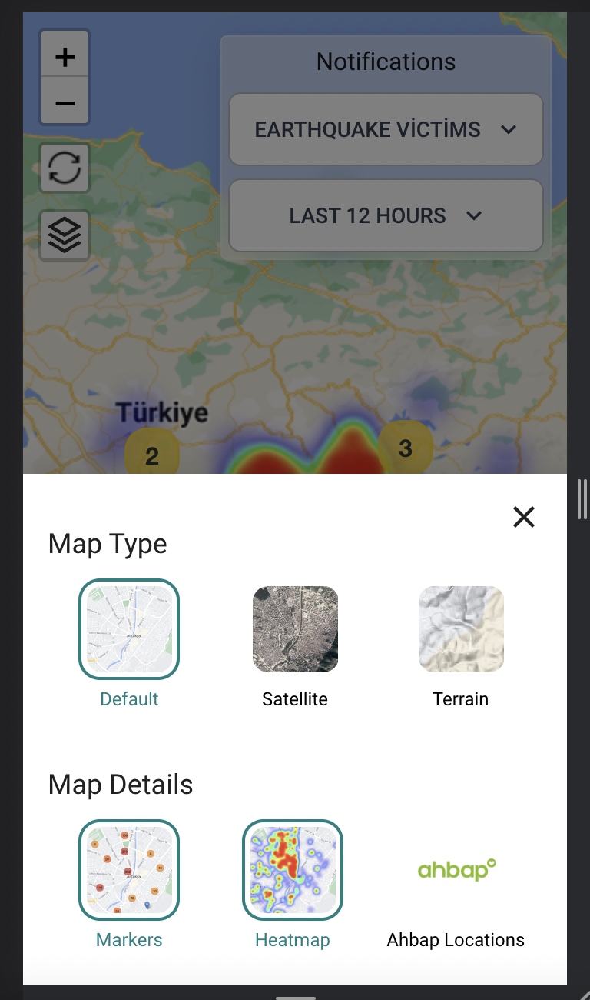
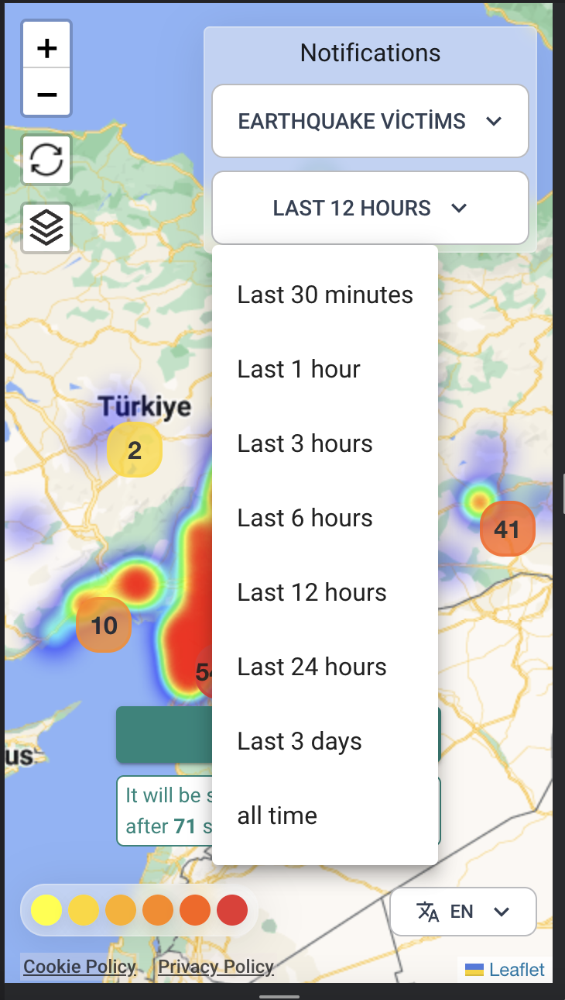

# What is "AfetHarita.com"

[Afet Harita](https://afetharita.com) is a story of collaboration and innovation, driven by a sense of responsibility to help those in need. The project was born on February 6, 2023, as a response to the devastating earthquakes that have hit Turkey in recent years. A group of tens of thousands of IT professionals, all volunteers, came together on a Discord server to find a way to help earthquake victims.

Their vision was to create a map that could visualize the sounds of earthquake victims, and pinpoint their location, to help rescue teams find them more quickly. It was a daunting task, but these heroes were determined to make it happen. They worked tirelessly to develop a platform that would connect victims with rescue teams in real-time, and help save lives in the critical first hours after an earthquake.

# Why Afet Harita Was Needed

The devastating earthquake that struck Turkey on February 6, 2023, left thousands of people in a desperate situation. The immediate aftermath of the earthquake saw communication between those affected and rescue teams being extremely difficult. Caught unprepared, people began making requests for help on social media platforms, which were quickly flooded with messages, making it difficult to provide timely assistance to those in need.

This is where Afet Harita came in. Afet Harita, which means "Disaster Map" in Turkish, was developed as a response to this urgent need for a platform that could facilitate communication and aid distribution during disasters. The project was initiated on the same day (February 6, 2023), and tens of thousands of volunteer IT employees joined forces on a Discord server to help visualize the sounds of earthquake victims on a map.

The need for a platform like Afet Harita became evident as it provided an essential service during a time of crisis. It enabled those affected by the earthquake to report their location and specific needs, making it easier for aid workers to prioritize their response efforts. The selfless efforts of the volunteers who came together to build this platform proved to be instrumental in providing assistance to those affected by the disaster, and their contribution is highly appreciated.

# What Happened Next?

After the necessary communications were established, a team of bright-minded and dedicated engineers came together to turn the requests for help on social media into readable data. By utilizing technologies such as machine learning (ML) and artificial intelligence (AI), the team was able to organize and verify the data, making it usable in a disaster response situation.

Throughout the process, thousands of people worked tirelessly day and night, volunteering their time and skills to help those affected by the disaster. The Afet Harita project quickly gained momentum, and a single discord server became the central hub for thousands of people to collaborate and coordinate their efforts.

Despite the challenges and obstacles, the team's dedication and persistence paid off. The result was a powerful tool that could help disaster response teams quickly identify areas of need and direct resources to those in the most urgent need of help. The Afet Harita project serves as a powerful example of how technology and collaboration can be used for the greater good in times of crisis.

Working together with people they have never met in their field, they have developed a very fast product that can handle **500 thousand unique users and millions of traffic on the first day of its released**.

**Race against time**
 
In an extraordinary effort, the Afet Harita team worked around the clock to turn the verified data into a working application. Despite the overwhelming amount of data, the complexities of integrating multiple services, and the shortage of time, the team managed to go live on the second day after the disaster. This is an incredible achievement and a testament to the skills and dedication of the team.

None of this would have been possible without the hard work and dedication of these amazing volunteers in [AYA](https://github.com/acikkaynak. Their collaboration, communication, and lightning-fast actions helped turn a dream into a reality. We owe them a debt of gratitude for their selfless work, and we hope that their efforts will inspire others to make a difference in their own communities.

As we continue to improve and expand the Afet Harita platform, we will never forget our roots, and the incredible journey that brought us here. We are committed to making a positive impact in the world, and we will always remember the power of collaboration and innovation that got us started.

Will add more details later.

- What is the result?
- What is the future?